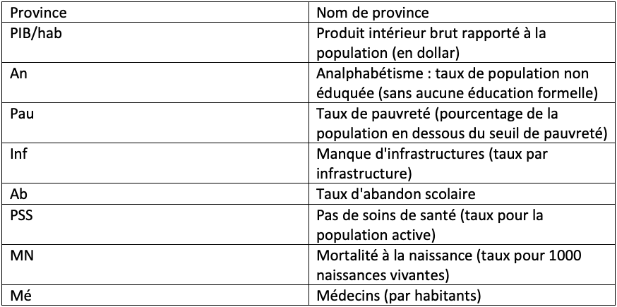

```{r setup, include=FALSE}
knitr::opts_chunk$set(echo = TRUE, message = FALSE, warning = FALSE)
```

------------------------------------------------------------------------

## Préambule

Cette étude s'adresse aux représentants de la division argentine de l'UNICEF dans le cadre des programmes "Women empowerment" et "No-Poor" dont l'objectif est de faire face à la crise sociale en cours.

L'objectif de cette étude est de cibler les provinces administratives argentines (hors Buenos Aires) dans lesquelles les programmes de transferts monétaires cités précédemment seraient les plus pertinents.

Deux cibles à déterminer :

-   Les deux provinces les plus vulnérables (programme "Women empowerment")
-   Les provinces les plus riches et les mieux dotées sanitairements (programme "No-Poor")

Pour déterminer ces deux cibles, nous allons utiliser des outils de statistiques exploratoires.

```{r}
#========== chargement des données ==========
arg <- read.csv(file = "argentina.csv", sep = ",", header = T)

#========== traduction en français des variables du jeu de données ==========
colnames(arg) <- c("Province", "PIB", "An", "Pau", "Inf", "Ab", "PSS", "MN", "Pop", "SC", "Mé" )

#========== préparation du jeu de données ==========
row.names(arg) <- c("Buenos Aires", "Catamarca", "Cordoba", "Corrientes", "Chaco", "Chubut", "Entre-Rios", "Formosa", "Jujuy", "La Pampa", "La Rioja", "Mendoza", "Misiones", "Neuquen", "Rio-Negro", "Salta", "San Juan", "San Luis", "Santa Cruz", "Santa Fe", "Santiago del Estero", "Tucuman")
arg <- arg[, -1]

#========== création et suppression de variables/individu ==========
arg[,"PIB"] <- arg[,"PIB"]/arg[,"Pop"] # création de la variable PIB/habitant
colnames(arg)[1] <- "PIB/hab"
arg <- arg[-1,c(-8,-9)] # suppression des variables "Pop", "Salles de cinéma" et de l'individu "Buenos Aires"
```

**Métadonnées**



------------------------------------------------------------------------

## 1. Ciblage des deux provinces les plus vulnérables : programme "Women empowerment"

Afin de déterminer les deux provinces les plus vulnérables, nous allons procéder à une Analyse en Composantes Principales (ACP).
C'est une méthode d'analyse qui permet de détecter des proximités entre variables, entre individus, entre variables et individus en mettant à jour les liens ou au contraire les "répulsions". Elle permet de réorganiser et hiérarchiser l'information en perdant le moins d'information possible. Pour déterminer les provinces les plus vulnérables, nous allons utiliser toutes les variables disponibles dans notre jeu de données car chacune d'entre-elles représentent un critère de vulnérabilité.

------------------------------------------------------------------------

### 1.1. Mise en place de l'ACP et vérification des paramètres de qualité et de contribution

```{r}
#========== qualité de l'ensemble des corrélations (test de Bartlett) ==========
library(psych)
mat_r <- cor(arg)
bar.test <- cortest.bartlett(mat_r, n=nrow(arg))
# le résultat du test de Bartlett est significatif (p < 0,0005). Nous pouvons donc rejetter l'hypothèse nulle, les corrélations ne sont pas toutes égales à 0 : nous pouvons continuer notre analyse

#========== réalisation de l'ACP ==========
library(factoextra)
library(FactoMineR)
arg.pca <- PCA(arg, graph = F)
```

Une dimension est une combinaison linéaire unique de toutes les variables du tableau élémentaire de données. Chaque dimension est indépendante des autres et prend en compte une partie de l'information totale.

```{r}
#========== inertie cumulée captée par les dimensions ==========
cumsum(eigen(cor(arg))$values)/sum(eigen(cor(arg))$values)*100
```

Dans notre cas, les deux premières dimensions expliquent environ 67% de l'information, ce qui est suffisant pour s'appuyer uniquement sur ces deux dernières dans notre étude.

Comme nous allons le voir ci-dessous, nous n'interprérons que les variables et les individus qui ont à la fois un cosinus carré supérieur à 0.5 et une contribution supérieure à la moyenne.

Le cosinus carré est une mesure de qualité de représentation de la variable sur la dimension.

```{r}
#========== qualité de représentation des variables sur les deux premières dimensions ==========
fviz_cos2(arg.pca,
          title = "Qualité de représentation des variables sur les deux premières dimensions (Cos2)",
          choice = "var",
          axes = 1:2,
          ggtheme = theme_minimal())
```

Dans notre analyse nous laisserons de côté la variable de Mortalité à la naissance.

Comme nous l'avons vu précédemment, chaque dimension prend en compte une partie différente de l'information. La contribution des variables est une indication de leur influence sur la structuration du facteur.

```{r}
#========== contribution des variables sur la première dimension ==========
fviz_contrib(arg.pca,
             title = "Contribution des variables sur la première dimension (%)",
             choice = "var",
             axes = 1,
             ggtheme = theme_classic())
```

Sur la première dimension, on interprètera uniquement les variables Pas de soins de santé, Analphabétisme, Pauvreté et PIB/hab.

```{r}
#========== contribution des variables sur la deuxième dimension ==========
fviz_contrib(arg.pca,
             title = "Contribution des variables sur la deuxième dimension (%)",
             choice = "var",
             axes = 2,
             ggtheme = theme_classic())
```

Sur la deuxième dimension, on interprètera uniquement les variables Abandon scolaire et Médecins par habitants.

De la même manière que pour les variables, le cosinus carré est une mesure de qualité de représentation des individus sur la dimension.

```{r}
#========== qualité de représentation des individus sur les deux premières dimensions ==========
fviz_cos2(arg.pca,
          title = "Qualité de représentation des individus sur les deux premières dimensions (Cos2)",
          choice = "ind",
          axes = 1:2,
          ggtheme = theme_minimal())
```

Nous n'interpréterons pas les provinces de Jujuy, San Juan, La Pampa, Entre-Rios et Tucuman.

```{r}
#========== contribution des individus sur les deux premières dimensions ==========
fviz_contrib(arg.pca,
             title = "Contribution des individus sur les deux premières dimensions (%)",
             choice = "ind",
             axes = 1:2,
             ggtheme = theme_classic())
```

De plus, comme pour les variables, on interprètera uniquement les individus à la contribution supérieure à la moyenne : Chaco, Formosa, Santa Cruz, Cordoba, Corrientes, Misiones, Santiago del Estero et Chubut.

------------------------------------------------------------------------

### 1.2. Visualisation de l'ACP

```{r}
#========== visualisation de l'ACP ==========
fviz_pca_biplot(arg.pca,
                title = "Résultat de l'Analyse en Composante Principale",
                xlab = "PIB/hab, Analphabétisme, Manque de soins sanitaires et Pauvreté",
                ylab = "Abandon scolaire et Médecins/hab",
                geom = c("point", "text"),
                select.ind = list(cos2 = 0.5, contrib = 8),
                select.var = list(cos2 = 0.5, contrib = 6),
                col.ind = "cos2",
                repel = T,
                ggtheme = theme_classic()) + scale_color_gradient(low = "yellow",
                       high = "red")
```

L'analphabétisme, le manque de soins sanitaires et la pauvreté sont des variables corrélées entres elles et sont corrélées négativement avec le PIB/hab.

En revanche il existe peu (ou pas) de lien de corrélation entre les variables citées précédement et le nombre de médecins par habitants d'une part et l'abandon scolaire d'autre part. (Le PIB/hab est légèrement corrélé négativement à l'abandon scolaire et le nombre de médecins par habitants est légèrement corrélé négativement à la pauvreté).


------------------------------------------------------------------------

## 2. Ciblage des provinces les plus riches et les mieux dotées sanitairement : programme "No-Poor"

Afin de déterminer quelles sont les provinces les plus riches et les mieux dotées sanitairement, nous allons retirer les variables qui ne sont pas en lien avec ces critères : l'analphabétisme, le manque d'infrastructures et l'abandon scolaire.

Pour les identifier, nous allons les regrouper dans un sous-ensemble. Pour réaliser des sous-ensembles cohérents et homogènes, nous allons utiliser deux méthodes de partitionnement : les K-means et la Classification Hiérarchique.

Croiser deux méthodes nous permettra d'identifier de manière très précise les individus ciblés.

```{r}
arg <- arg[,c(-2,-4,-5)]
```


------------------------------------------------------------------------

### 2.1. Méthode des K-means

La méthode des K-means est une méthode de partitionnement qui considère la distance d'un point à la moyenne des points de son sous-ensemble. Pour réaliser son partitionnement, la somme des carrés de ces distances est minimisée.

```{r}
#========== préparation du jeu de données ==========
arg <- na.omit(arg) # retrait des valeurs manquantes
argS <- scale(arg) # standardisation
```

***

#### Déterminer le nombre approprié de sous-ensembles (clusters)

Pour déterminer le nombre optimal de clusters à utiliser, nous allons nous appuyer sur trois indices différents : le "coude d'effondrement", la "silouhette" et le "gap stat".

```{r}
#========== le "coude d'effondrement" ==========
fviz_nbclust(argS, kmeans, method = "wss") + theme_classic()
```

La méthode du "coude d'effondrement" se base sur la somme des carrés intra-cluster. Ici, l'emplacement du "coude" est visible au niveau de deux clusters, nous allons donc retenir que le nombre optimal de cluster est de deux en fonction de cet indice. (On estime qu'il faut au minimum deux clusters donc on vérifie s'il y a un "coude" significatif après deux, mais ce n'est pas le cas ici).

```{r}
#========== la "silhouette" ==========
fviz_nbclust(argS, kmeans, method = "silhouette") + theme_classic()
```

L'approche de la "silouhette moyenne" mesure la qualité d'un regroupement, ici elle nous indique clairement que le nombre optimal de cluster est de deux.

```{r}
#========== le "gap stat" ==========
library(cluster)
gap_stat <- clusGap(argS,
                    FUN = kmeans,
                    nstart = 25,
                    K.max = 15,
                    B = 50)
#print(gap_stat,
#      method = "firstmax")
fviz_gap_stat(gap_stat)+theme_classic()
```

Le "gap stat" est une méthode qui se base sur la comparaison de la variance totale intra-cluster. Ici, l'indice nous indique que le nombre optimal de clusters est de deux (la courbe redescend après deux).

------------------------------------------------------------------------

#### K-means : partition finale

Compte tenu des informations apportées par les trois indices, nous allons retenir le nombre de deux clusters pour notre partition finale.

```{r}
#========== visualisation des K-means ==========
final <- kmeans(argS, 2, nstart = 25)
fviz_cluster(final,
             main = "Partition avec la méthode des K-means",
             axes = 1:2,
             data = argS,
             xlab = "Pauvreté, Manque de soins sanitaires et PIB/hab",
             ylab = "Médecins/hab et Mortalité à la naissance",
             show.clust.cent = F,
             ellipse = F,
             ellipse.alpha = 0.1,
             repel = T)+theme_minimal()
```

```{r}
#========== résumé des clusters ==========
library(dplyr)
library(kableExtra)

MClust <- arg %>%
mutate(Cluster = final$cluster) %>%
group_by(Cluster) %>%
summarise_all("mean")
kable(MClust, digits = 2) %>%
kable_minimal()
```

Cependant, avec une partition à deux clusters, nous distinguons des disparités importantes au sein même du cluster des provinces les plus riches et les mieux dotées sanitairement. Essayons avec quatre clusters.

```{r}
#========== visualisation des K-means ==========
final <- kmeans(argS, 4, nstart = 25)
fviz_cluster(final,
             main = "Partition avec la méthode des K-means",
             axes = 1:2,
             data = argS,
             xlab = "Pauvreté, Manque de soins sanitaires et PIB/hab",
             ylab = "Médecins/hab et Mortalité à la naissance",
             show.clust.cent = F,
             ellipse = F,
             ellipse.alpha = 0.1,
             repel = T)+theme_minimal()
```


```{r}
#========== résumé des clusters ==========
MClust <- arg %>%
mutate(Cluster = final$cluster) %>%
group_by(Cluster) %>%
summarise_all("mean")
kable(MClust, digits = 2) %>%
kable_minimal()
```

Le partitionnement à quatre clusters nous permet d'identifier avec plus de précision les provinces les plus riches et les mieux dotées sanitairement : Neuquen, Chubut et Santa Cruz. Ces provinces ont un PIB/hab moyen deux fois supérieur au second cluster en terme de PIB/hab. Le manque de soins sanitaires y est le moins élevé et la mortalité à la naissance y est la plus faible.

------------------------------------------------------------------------

### 2.2. Méthode de la Classification Hiérarchique

La méthode de la Classification Hiérarchique se base sur la proximité entres individus.

Nous allons utiliser l'algorithme AGNES (Agglomerative Nesting) qui a un fonctionnement ascendant. Chaque objet est considéré comme un cluster à lui seul, puis, les deux clusters les plus proches sont assemblés en un nouveau cluster, cette procédure se répète jusqu'à ce que tous les points forment un seul et même cluster. On parle alors de Classification Ascendante Hiérarchique (CAH).

L'algorithme AGNES fonctionne en minimisant l'inertie intra-groupe et en maximisant l'inertie inter-groupe. Pour mesurer l'inertie intra-groupe, nous allons utiliser la distance euclidienne ("à vol d'oiseau"). Mais pour mesurer l'inertie inter-groupe, nous devons déterminer la meilleure méthode de "linkage" (liaison) à utiliser.

***

#### Déterminer la méthode d'agglomération optimale

Il en existe quatre : le Single linkage, le Complete linkage, l'Average linkage et le Ward linkage. Nous allons utiliser le coefficient d'agglomération de la fonction agnes qui nous permettra de définir la méthode de "linkage". Ce coefficient d'agglomération mesure la quantité de structure de regroupement trouvée.

```{r}
#========== chargement des packages ==========
library(cluster)
library(purrr)

#========== méthodes à comparer ==========
m <- c( "average", "single", "complete", "ward")
names(m) <- c( "average", "single", "complete", "ward")

#========== calcul des différents coefficients ==========
distanceE <- get_dist(arg)
ac <- function(x)
agnes(distanceE, method = x)$ac
map_dbl(m, ac)
```

La méthode de Ward donne la structure de regroupement la plus forte. Nous allons donc l'utiliser pour mesurer l'inertie inter-groupe.

***

#### Déterminer le nombre approprié de sous-ensembles (clusters)

```{r}
#========== le "coude d'effondrement" ==========
fviz_nbclust(argS, FUN = hcut, method = "wss")+theme_classic()
```

Le "coude d'effondrement" nous donne deux comme le nombre de clusters optimal.

```{r}
#========== la "silhouette" ==========
fviz_nbclust(argS, FUN = hcut, method = "silhouette")+theme_classic()
```

La "silouhette moyenne" nous donne deux comme le nombre de cluster optimal.

```{r}
#========== le "gap stat" ==========
library(cluster)
gap_stat <- clusGap(argS,
                    FUN = hcut,
                    nstart = 25,
                    K.max = 10,
                    B = 50)
#print(gap_stat, method = "firstmax")
fviz_gap_stat(gap_stat)+theme_classic()
```

Le "gap stat" nous donne deux comme le nombre de cluster optimal.

***

#### CAH : partition finale

Compte tenu des informations apportées par les trois indices, nous allons retenir le nombre de deux clusters pour notre partition finale.

```{r}
#========== CAH avec la méthode de Ward et la distance euclidienne ==========
cah <- hclust(distanceE, method = "ward.D2" )

#========== visualisation du dendrogramme ==========
fviz_dend(cah,
          main = "Partition avec la méthode de la Classification Ascendante Hiérarchique",
          k = 2,
          cex = 0.6,
          horiz = T,
          rect = T,
          rect_fill = T) + theme_classic()
```

Comme pour la méthode des K-means, avec une partition à deux clusters, nous distinguons des disparités importantes au sein même du cluster des provinces les plus riches et les mieux dotées sanitairement. Essayons avec quatre clusters.

```{r}
#========== visualisation du dendrogramme ==========
fviz_dend(cah,
          main = "Partition avec la méthode de la Classification Ascendante Hiérarchique",
          k = 4,
          cex = 0.6,
          horiz = T,
          rect = T,
          rect_fill = T) + theme_classic()
```

Comme pour la méthode des K-means, le partitionnement à quatre clusters nous permet d'identifier avec plus de précisions les provinces les plus riches et les mieux dotées sanitairement : Neuquen, Chubut et Santa Cruz.

***

### 2.3. Comparaison des résultats de la CAH et des K-means

```{r}
#========== partitionnement avec la méthode des K-means ==========
final <- kmeans(argS, 4, nstart = 25)

p1 <- fviz_cluster(final,
                   main = "Partition avec la méthode des K-means",
                   axes = 1:2,
                   data = argS,
                   xlab = "Pauvreté, Manque de soins sanitaires et PIB/hab",
                   ylab = "Mé et MN",
                   show.clust.cent = F,
                   ellipse = T,
                   ellipse.alpha = 0.1,
                   repel = T)+theme_classic()

#========== partitionnement avec la méthode de la CAH sur un plan à deux dimensions ========== 
sub_grp <- cutree(cah, k=4)

p2 <- fviz_cluster(list(data = argS, cluster = sub_grp),
                   main = "Partition avec la méthode de Classification Ascendante Hiérarchique",
                   xlab = "Pauvreté, Manque de soins sanitaires et PIB/hab",
                   ylab = "Mé et MN",
                   show.clust.cent = F,
                   ellipse = T,
                   ellipse.alpha = 0.1,
                   repel = T)+theme_classic()

#========== comparaison visuelle ==========
library(gridExtra)
grid.arrange(p1, p2, nrow = 2)
```

Si les deux méthodes proposent une partition différente, nous remarquons que le cluster des provinces les plus riches et les mieux dotées sanitairement est le même : Neuquen, Chubut et Santa Cruz.

***

## Résultats de l'étude

Les résultats de notre étude montrent que :

-   Le programme "Women empowerment" à destination des deux provinces les plus vulnérables pourrait être déstiné à Formosa et Chaco.
-   Le programme "No-Poor" à destination des provinces les plus riches et les mieux dotées sanitairements pourrait être déstiné à Neuquen, Chubut et Santa Cruz.
